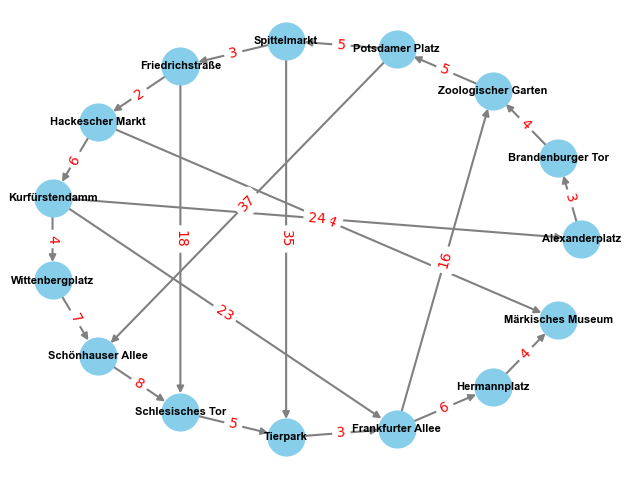

### Граф метро в Берліні

### Висновки

| Алгоритм                       | Знайдений шлях                                                                                                                                                                                                                                                                                 | Особливості                                                                                                                                                                                                                                                                    |
| ------------------------------ | ---------------------------------------------------------------------------------------------------------------------------------------------------------------------------------------------------------------------------------------------------------------------------------------------- | ------------------------------------------------------------------------------------------------------------------------------------------------------------------------------------------------------------------------------------------------------------------------------ |
| **DFS (Depth-First Search)**   | `['Alexanderplatz', 'Brandenburger Tor', 'Zoologischer Garten', 'Potsdamer Platz', 'Spittelmarkt', 'Friedrichstraße', 'Hackescher Markt', 'Kurfürstendamm', 'Wittenbergplatz', 'Schönhauser Allee', 'Schlesisches Tor', 'Tierpark', 'Frankfurter Allee', 'Hermannplatz', 'Märkisches Museum']` | Обравши один шлях, DFS докладно дослідив його, проходячи глибше вглиб графа.   Порядок додавання вершин може впливати на вибір шляху. DFS обрав шлях, який проходить через більше вершин одного напрямку перед тим, як досліджує інший напрямок.                            |
| **BFS (Breadth-First Search)** | `['Alexanderplatz', 'Brandenburger Tor', 'Zoologischer Garten', 'Potsdamer Platz', 'Spittelmarkt', 'Friedrichstraße', 'Hackescher Markt', 'Märkisches Museum']`                                                                                                                                | Розглядаючи всі доступні вершини на одному рівні перед переходом на інший рівень, BFS знайшов шлях, який перетинає всі станції на одному рівні графа.   Порядок додавання вершин враховується, і BFS розглядає всі вершини на одному рівні перед переходом на інший рівень. |

### Маршрути випадкових початкових та кінцевих станцій

| Алгоритм | Початковий вузол  | Кінцевий вузол    | Маршрут                                                                                                                                                                                                                                                                                      |
| -------- | ----------------- | ----------------- | -------------------------------------------------------------------------------------------------------------------------------------------------------------------------------------------------------------------------------------------------------------------------------------------- |
| DFS      | Schlesisches Tor  | Hermannplatz      | ['Schlesisches Tor', 'Tierpark', 'Frankfurter Allee', 'Hermannplatz', 'Märkisches Museum', 'Zoologischer Garten', 'Potsdamer Platz', 'Spittelmarkt', 'Friedrichstraße', 'Hackescher Markt', 'Kurfürstendamm', 'Wittenbergplatz', 'Schönhauser Allee', 'Alexanderplatz', 'Brandenburger Tor'] |
| BFS      | Schlesisches Tor  | Hermannplatz      | ['Schlesisches Tor', 'Tierpark', 'Frankfurter Allee', 'Hermannplatz']                                                                                                                                                                                                                        |
| DFS      | Brandenburger Tor | Hermannplatz      | ['Schlesisches Tor', 'Tierpark', 'Frankfurter Allee', 'Hermannplatz', 'Märkisches Museum', 'Zoologischer Garten', 'Potsdamer Platz', 'Spittelmarkt', 'Friedrichstraße', 'Hackescher Markt', 'Kurfürstendamm', 'Wittenbergplatz', 'Schönhauser Allee', 'Alexanderplatz', 'Brandenburger Tor'] |
| BFS      | Schlesisches Tor  | Hermannplatz      | ['Schlesisches Tor', 'Tierpark', 'Frankfurter Allee', 'Hermannplatz']                                                                                                                                                                                                                        |
| DFS      | Tierpark          | Potsdamer Platz   | ['Tierpark', 'Frankfurter Allee', 'Hermannplatz', 'Märkisches Museum', 'Zoologischer Garten', 'Potsdamer Platz', 'Spittelmarkt', 'Friedrichstraße', 'Hackescher Markt', 'Kurfürstendamm', 'Wittenbergplatz', 'Schönhauser Allee', 'Schlesisches Tor', 'Alexanderplatz', 'Brandenburger Tor'] |
| BFS      | Tierpark          | Potsdamer Platz   | ['Tierpark', 'Frankfurter Allee', 'Zoologischer Garten', 'Potsdamer Platz']                                                                                                                                                                                                                  |
| DFS      | Potsdamer Platz   | Alexanderplatz    | ['Potsdamer Platz', 'Spittelmarkt', 'Friedrichstraße', 'Hackescher Markt', 'Kurfürstendamm', 'Wittenbergplatz', 'Schönhauser Allee', 'Schlesisches Tor', 'Tierpark', 'Frankfurter Allee', 'Hermannplatz', 'Märkisches Museum', 'Zoologischer Garten', 'Alexanderplatz', 'Brandenburger Tor'] |
| BFS      | Potsdamer Platz   | Alexanderplatz    | ['Potsdamer Platz', 'Spittelmarkt', 'Friedrichstraße', 'Hackescher Markt', 'Kurfürstendamm', 'Alexanderplatz']                                                                                                                                                                               |
| DFS      | Kurfürstendamm    | Alexanderplatz    | ['Kurfürstendamm', 'Wittenbergplatz', 'Schönhauser Allee', 'Schlesisches Tor', 'Tierpark', 'Frankfurter Allee', 'Hermannplatz', 'Märkisches Museum', 'Zoologischer Garten', 'Potsdamer Platz', 'Spittelmarkt', 'Friedrichstraße', 'Hackescher Markt', 'Alexanderplatz', 'Brandenburger Tor'] |
| BFS      | Kurfürstendamm    | Alexanderplatz    | ['Kurfürstendamm', 'Alexanderplatz']                                                                                                                                                                                                                                                         |
| DFS      | Schönhauser Allee | Hackescher Markt  | ['Schönhauser Allee', 'Schlesisches Tor', 'Tierpark', 'Frankfurter Allee', 'Hermannplatz', 'Märkisches Museum', 'Zoologischer Garten', 'Potsdamer Platz', 'Spittelmarkt', 'Friedrichstraße', 'Hackescher Markt', 'Kurfürstendamm', 'Wittenbergplatz', 'Alexanderplatz', 'Brandenburger Tor'] |
| BFS      | Schönhauser Allee | Hackescher Markt  | ['Schönhauser Allee', 'Schlesisches Tor', 'Tierpark', 'Frankfurter Allee', 'Zoologischer Garten', 'Potsdamer Platz', 'Spittelmarkt', 'Friedrichstraße', 'Hackescher Markt']                                                                                                                  |
| DFS      | Brandenburger Tor | Spittelmarkt      | ['Brandenburger Tor', 'Zoologischer Garten', 'Potsdamer Platz', 'Spittelmarkt', 'Friedrichstraße', 'Hackescher Markt', 'Kurfürstendamm', 'Wittenbergplatz', 'Schönhauser Allee', 'Schlesisches Tor', 'Tierpark', 'Frankfurter Allee', 'Hermannplatz', 'Märkisches Museum', 'Alexanderplatz'] |
| BFS      | Brandenburger Tor | Spittelmarkt      | ['Brandenburger Tor', 'Zoologischer Garten', 'Potsdamer Platz', 'Spittelmarkt']                                                                                                                                                                                                              |
| DFS      | Schlesisches Tor  | Hermannplatz      | ['Schlesisches Tor', 'Tierpark', 'Frankfurter Allee', 'Hermannplatz', 'Märkisches Museum', 'Zoologischer Garten', 'Potsdamer Platz', 'Spittelmarkt', 'Friedrichstraße', 'Hackescher Markt', 'Kurfürstendamm', 'Wittenbergplatz', 'Schönhauser Allee', 'Alexanderplatz', 'Brandenburger Tor'] |
| BFS      | Schlesisches Tor  | Hermannplatz      | ['Schlesisches Tor', 'Tierpark', 'Frankfurter Allee', 'Hermannplatz']                                                                                                                                                                                                                        |
| DFS      | Frankfurter Allee | Friedrichstraße   | ['Frankfurter Allee', 'Hermannplatz', 'Märkisches Museum', 'Zoologischer Garten', 'Potsdamer Platz', 'Spittelmarkt', 'Friedrichstraße', 'Hackescher Markt', 'Kurfürstendamm', 'Wittenbergplatz', 'Schönhauser Allee', 'Schlesisches Tor', 'Tierpark', 'Alexanderplatz', 'Brandenburger Tor'] |
| BFS      | Frankfurter Allee | Friedrichstraße   | ['Frankfurter Allee', 'Zoologischer Garten', 'Potsdamer Platz', 'Spittelmarkt', 'Friedrichstraße']                                                                                                                                                                                           |
| DFS      | Friedrichstraße   | Märkisches Museum | ['Friedrichstraße', 'Hackescher Markt', 'Kurfürstendamm', 'Wittenbergplatz', 'Schönhauser Allee', 'Schlesisches Tor', 'Tierpark', 'Frankfurter Allee', 'Hermannplatz', 'Märkisches Museum', 'Zoologischer Garten', 'Potsdamer Platz', 'Spittelmarkt', 'Alexanderplatz', 'Brandenburger Tor'] |
| BFS      | Friedrichstraße   | Märkisches Museum | ['Friedrichstraße', 'Hackescher Markt', 'Märkisches Museum']                                                                                                                                                                                                                                 |
| DFS      | Frankfurter Allee | Potsdamer Platz   | ['Frankfurter Allee', 'Hermannplatz', 'Märkisches Museum', 'Zoologischer Garten', 'Potsdamer Platz', 'Spittelmarkt', 'Friedrichstraße', 'Hackescher Markt', 'Kurfürstendamm', 'Wittenbergplatz', 'Schönhauser Allee', 'Schlesisches Tor', 'Tierpark', 'Alexanderplatz', 'Brandenburger Tor'] |
| BFS      | Frankfurter Allee | Potsdamer Platz   | ['Frankfurter Allee', 'Zoologischer Garten', 'Potsdamer Platz']                                                                                                                                                                                                                              |
| DFS      | Brandenburger Tor | Potsdamer Platz   | ['Brandenburger Tor', 'Zoologischer Garten', 'Potsdamer Platz', 'Spittelmarkt', 'Friedrichstraße', 'Hackescher Markt', 'Kurfürstendamm', 'Wittenbergplatz', 'Schönhauser Allee', 'Schlesisches Tor', 'Tierpark', 'Frankfurter Allee', 'Hermannplatz', 'Märkisches Museum', 'Alexanderplatz'] |
| BFS      | Brandenburger Tor | Potsdamer Platz   | ['Brandenburger Tor', 'Zoologischer Garten', 'Potsdamer Platz']                                                                                                                                                                                                                              |
